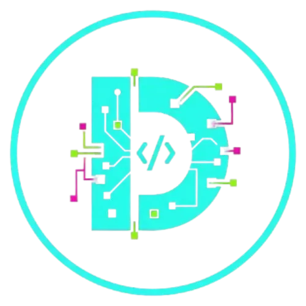

# 💼 Portfólio Profissional - Dony

<div align="center">



**Desenvolvedor Full-Stack | React • Node.js • Flutter**

[](https://donydev.netlify.app/)
[](https://github.com/donyxxj7)
[](https://www.linkedin.com/in/endony-paradela-rodrigues-5770312ba/)

</div>

---

## 🎯 Sobre o Projeto

Portfólio profissional moderno desenvolvido com as mais recentes tecnologias web, apresentando meus projetos, habilidades e experiência como desenvolvedor Full-Stack. O design minimalista com tema dark e acentos em ciano proporciona uma experiência visual profissional e agradável.

### ✨ Características Principais

- 🎨 **Design Moderno**: Interface dark theme com paleta de cores profissional
- 📱 **Totalmente Responsivo**: Adaptado para desktop, tablet e mobile
- ⚡ **Performance Otimizada**: Carregamento rápido e animações suaves
- 🎭 **Animações Elegantes**: Transições e efeitos visuais sofisticados
- 🔍 **SEO Otimizado**: Meta tags e estrutura semântica para melhor indexação
- ♿ **Acessível**: Seguindo boas práticas de acessibilidade web

---

## 🚀 Tecnologias Utilizadas

<div align="center">

### Frontend


### Styling


### Tools & Libraries


</div>

---

## 📂 Estrutura do Projeto

```
dony-portfolio-pro/
├── client/
│   ├── public/
│   │   ├── logo.webp              # Logo personalizada
│   │   ├── dony-photo.jpg        # Foto profissional
│   │   ├── linkhub.webp           # Screenshot projeto LinkHub
│   │   ├── cine-info.webp         # Screenshot projeto Cine-Info
│   │   ├── bagdzunhas.webp        # Screenshot projeto Bagdzunhas
│   │   └── meu-bairro-joinville.webp  # Screenshot projeto MBJ
│   ├── src/
│   │   ├── components/
│   │   │   ├── ui/               # Componentes shadcn/ui
│   │   │   ├── Navbar.tsx        # Navegação responsiva
│   │   │   └── ErrorBoundary.tsx # Tratamento de erros
│   │   ├── pages/
│   │   │   ├── Home.tsx          # Página principal
│   │   │   └── NotFound.tsx      # Página 404
│   │   ├── contexts/
│   │   │   └── ThemeContext.tsx  # Gerenciamento de tema
│   │   ├── hooks/                # Custom hooks
│   │   ├── lib/
│   │   │   └── utils.ts          # Funções utilitárias
│   │   ├── App.tsx               # Componente raiz
│   │   ├── main.tsx              # Entry point
│   │   └── index.css             # Estilos globais
│   └── index.html                # HTML template
├── package.json
├── tsconfig.json
├── vite.config.ts
└── README.md
```

---

## 🎨 Seções do Portfólio

### 1. 🏠 Hero Section
Apresentação impactante com nome, título e foto profissional, acompanhada de links para redes sociais e CTAs para projetos e contato.

### 2. 👨‍💻 Sobre Mim
Descrição profissional destacando experiência, paixão por tecnologia e objetivos como desenvolvedor.

### 3. 🚀 Projetos em Destaque
Showcase de 5 projetos principais:
- **Meu Bairro Joinville**: Plataforma de gestão urbana participativa
- **Alerta Inclusivo**: App de emergência acessível para pessoas com deficiência
- **LinkHub Full-Stack**: Agregador de links personalizado
- **Cine-Info**: Buscador de filmes interativo
- **Site Showcase para Manicure**: Portfólio digital profissional

### 4. 💻 Skills
Grid organizado com 16 tecnologias e ferramentas, incluindo nível de proficiência.

### 5. 💬 Depoimentos
Feedback real de clientes satisfeitos com os projetos desenvolvidos.

### 6. 📧 Contato
Seção com CTAs para email e LinkedIn, além de links para redes sociais.

---

## 🛠️ Instalação e Uso

### Pré-requisitos

- **Node.js** (v18 ou superior)
- **pnpm** (recomendado) ou npm

### Instalação

```bash
# Clone o repositório
git clone https://github.com/donyxxj7/dony-portfolio.git

# Entre na pasta do projeto
cd dony-portfolio-pro

# Instale as dependências
pnpm install
```

### Desenvolvimento

```bash
# Inicie o servidor de desenvolvimento
pnpm dev

# Acesse em http://localhost:3000
```

### Build para Produção

```bash
# Crie a build otimizada
pnpm build

# Visualize a build localmente
pnpm preview
```

---

## 🎨 Personalização

### Cores

As cores principais podem ser ajustadas em `client/src/index.css`:

```css
.dark {
  --primary: oklch(0.8 0.15 180);      /* Ciano principal */
  --accent: oklch(0.8 0.15 180);       /* Acento */
  --background: oklch(0.141 0.005 285.823);  /* Fundo escuro */
  --foreground: oklch(0.85 0.005 65);  /* Texto claro */
}
```

### Conteúdo

Para atualizar informações pessoais, edite `client/src/pages/Home.tsx`:
- Dados pessoais e descrição
- Links de redes sociais
- Projetos e descrições
- Skills e níveis de proficiência

### Imagens

Substitua as imagens em `client/public/`:
- `logo.webp` - Logo personalizada
- `dony-photo.jpg` - Foto profissional
- Screenshots dos projetos

---

## 🚀 Deploy

### Netlify (Recomendado)

1. Faça push do código para o GitHub
2. Conecte o repositório no Netlify
3. Configure:
   - **Build command**: `pnpm build`
   - **Publish directory**: `client/dist`
4. Deploy automático!

### Vercel

```bash
# Instale a CLI do Vercel
npm i -g vercel

# Deploy
vercel
```

### GitHub Pages

```bash
# Build
pnpm build

# Deploy para gh-pages
pnpm dlx gh-pages -d client/dist
```

---

## 📊 Performance

- ⚡ **Lighthouse Score**: 90+ em Performance
- ♿ **Acessibilidade**: 100
- 🎯 **Best Practices**: 100
- 🔍 **SEO**: 100

---

## 🤝 Contribuindo

Contribuições são bem-vindas! Se você encontrar algum problema ou tiver sugestões:

1. Faça um Fork do projeto
2. Crie uma branch para sua feature (`git checkout -b feature/AmazingFeature`)
3. Commit suas mudanças (`git commit -m 'Add some AmazingFeature'`)
4. Push para a branch (`git push origin feature/AmazingFeature`)
5. Abra um Pull Request

---

## 📝 Licença

Este projeto está sob a licença MIT. Veja o arquivo [LICENSE](LICENSE) para mais detalhes.

---

## 👨‍💻 Autor

<div align="center">

**Dony (Endony Paradela Rodrigues)**

Desenvolvedor Full-Stack especializado em React, Node.js e Flutter

[](https://github.com/donyxxj7)
[](https://www.linkedin.com/in/endony-paradela-rodrigues-5770312ba/)
[](https://www.instagram.com/donyy.xxj7/)
[](https://donydev.netlify.app/)

</div>

---

## 🙏 Agradecimentos

- [shadcn/ui](https://ui.shadcn.com/) - Componentes UI incríveis
- [Tailwind CSS](https://tailwindcss.com/) - Framework CSS utilitário
- [Lucide Icons](https://lucide.dev/) - Ícones modernos
- [React](https://react.dev/) - Biblioteca JavaScript

---

<div align="center">

**⭐ Se este projeto foi útil, considere dar uma estrela!**

Feito com ❤️ e ☕ por [Dony](https://github.com/donyxxj7)

</div>

